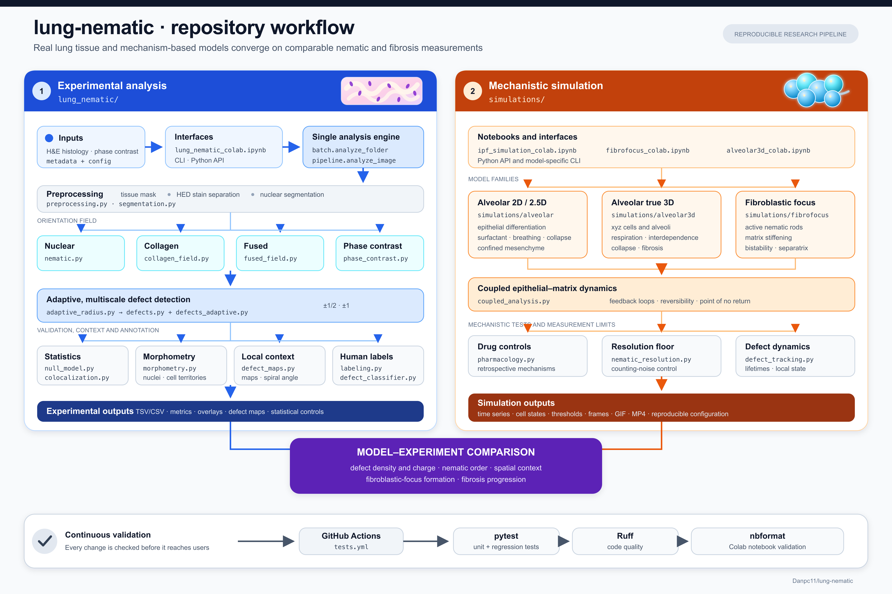
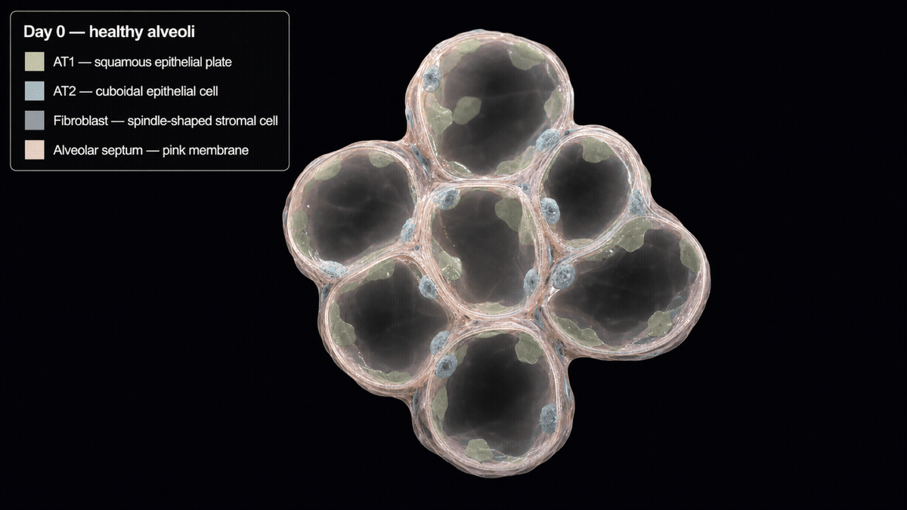

# Lung Nematic


[](https://github.com/Danpc11/lung-nematic/actions/workflows/tests.yml)
[](https://colab.research.google.com/github/Danpc11/lung-nematic/blob/main/lung_nematic_colab.ipynb)
[](https://colab.research.google.com/github/Danpc11/lung-nematic/blob/main/defect_labelling_colab.ipynb)
[](https://colab.research.google.com/github/Danpc11/lung-nematic/blob/main/ipf_simulation_colab.ipynb)
[](https://colab.research.google.com/github/Danpc11/lung-nematic/blob/main/fibrofocus_colab.ipynb)
[](https://colab.research.google.com/github/Danpc11/lung-nematic/blob/main/alveolar3d_colab.ipynb)

Nematic order in fibrotic lung, approached from three directions:

- **`lung_nematic/`** measures director fields and candidate topological defects
  in real H&E histology and in phase-contrast time lapses of cells on
  stiffness-controlled gels, with three orientation sources and statistical
  controls.
- **`simulations/`** builds the tissue from mechanism — alveolar architecture,
  the AT2 → KRT8+ → AT1 epithelial state machine, surfactant-driven collapse,
  breathing, and a confined mesenchyme — and asks when a lesion stops being
  reversible.
- **`lungtwin/`** asks what a study design can estimate at all, before an
  estimator exists.

The three are meant to constrain each other. The simulation is analysed with the
same winding criterion the histology pipeline uses, so defect densities are
comparable — but only once expressed at the same physical scale, which is not
automatic: the packaged configurations detect at 8.0 µm in histology and 28.2 µm
on a gel, and since density falls roughly as `1/σ²` that mismatch alone is about
a 12× offset. `crossmap` handles the conversion, and `simulations.stereology`
handles the further step that a histological section cuts *lines* in three
dimensions rather than counting points in two.

---
## Workflow



---
## Part 1 — Analysis of histology

### What it does

For each image the pipeline builds a coarse-grained director field, finds
half-integer (`+1/2`, `-1/2`) winding singularities that persist across
smoothing scales, and — optionally — an integer (`+1`, `-1`) layer, a
permutation null, a colocalization control, and a per-defect director map.

Three orientation sources:

- **nuclear** — from segmented nuclear long axes (cellular regions).
- **collagen** — from the structure tensor of the eosin channel (fiber
  architecture; dense, works where nuclei are sparse).
- **fused** — a presence-weighted combination of the two, following nuclei
  where cells are dense and collagen where fibers are.

Optional analyses (all off by default, all reproducible from the config):

- **integer defect layer** — `±1` defects (aster / vortex / saddle) detected by
  winding on an N-point ring, because a 4-corner plaquette cannot resolve a full
  `2*pi` director rotation. Off by default.
- **permutation null model** — shuffles orientations while holding positions,
  density, mask and detection fixed, so the observed defect count can be
  compared against chance. The nuclear null permutes per-nucleus angles; the
  collagen null permutes per-pixel eosin gradients.
- **colocalization test** — a bootstrap control comparing local order at
  defects against random eligible tissue, reporting both the defect **core**
  (expected low — a singularity) and a surrounding **annulus** (expected higher
  if the defect is embedded in an organised region). Controls are drawn from
  the same four-vertex gate the detector uses.
- **defect maps** — a crop per defect with the local director drawn as
  streamlines over the H&E, coloured by local order `S`. For `+1` defects the
  spiral angle `theta0` is estimated (aster `~0`, vortex `~±90 deg`). Integer
  defects are mapped from the collagen field only.

### Install

```bash
pip install "git+https://github.com/Danpc11/lung-nematic.git"
```

or, for development:

```bash
git clone https://github.com/Danpc11/lung-nematic.git
cd lung-nematic
pip install -e .
```

Installing also registers a `lung-nematic` console command, ships the default
analysis configuration, and installs both `lung_nematic` and `simulations`.
Simulation video export and the notebook figures additionally need the
`simulation` extra:

```bash
pip install -e ".[simulation]"
```

This pulls in `imageio`, `imageio-ffmpeg` and `seaborn`. Only the notebooks and
video rendering require them; the core analysis pipeline does not.

The Colab simulation notebook installs those runtime extras automatically.

## Usage

### Command line (batch)

```bash
lung-nematic --input path/to/images --output path/to/results
```

`--input` is a folder of images (`.jpg`, `.png`, `.tif`, ...). Results are
written per image under `--output`, plus a `summary_metrics_<field>.csv`, a
combined `summary_metrics.csv` rebuilt from every per-field file present, and a
per-group aggregate keyed by field and group. `--output` may not be `--input`;
if it is nested inside `--input` it is excluded from image discovery, so
generated overlays are never re-analysed as histology on a later run. `--config` is optional (the packaged default is used otherwise). An
optional `--metadata` CSV (see `metadata_template.csv`) supplies
`microns_per_pixel` and grouping, and matches rows by `filename` or
`relative_path`; a missing metadata path is an error rather than silently
ignored, and duplicate `image_id`s are rejected before processing.

For a flat image folder, `filename` is sufficient:

```csv
filename,image_id,group,microns_per_pixel
control_01.jpg,C01,control,0.45
fibrosis_01.jpg,F01,fibrosis,0.45
```

For recursive folders or repeated filenames, use `relative_path` and give every
image a unique `image_id`:

```csv
relative_path,image_id,group,microns_per_pixel
control/field_01.tif,C01,control,0.45
fibrosis/field_01.tif,F01,fibrosis,0.45
```

When both lookup columns exist, `relative_path` is attempted first and
`filename` is used as a fallback for rows whose relative path is blank or does
not match.

Selected flags (each overrides the config when given):

| Flag | Meaning |
| --- | --- |
| `--field {nuclear,collagen,fused}` | Orientation source |
| `--run-null` / `--no-run-null` | Permutation null model |
| `--run-colocalization` | Colocalization (core + annulus) |
| `--detect-integer-defects` | Add the `±1` ring layer |
| `--integer-loop-radius`, `--integer-loop-points` | Ring geometry for `±1` |
| `--save-defect-maps`, `--defect-map-window` | Per-defect director maps |
| `--mask-normalized-smoothing` | Confine smoothing to tissue (collagen) |
| `--n-permutations`, `--null-mode`, `--null-downsample` | Null model settings |
| `--null-n-jobs` | Threads for the permutation null (`-1` for all cores, default 1). Results are deterministic regardless of thread count. |
| `--n-bootstrap` | Colocalization bootstrap size |
| `--collagen-inner-scale` | Gradient scale of the structure tensor |
| `--seed` | Seed for all stochastic controls |
| `--config`, `--metadata`, `--stop-on-error` | Config, metadata, error policy |

The CLI, Colab and Python API use the same per-image engine. Their front ends
only differ in how they gather inputs and combine batch-level reports.

#### Colab (no local setup)

Open `lung_nematic_colab.ipynb` in Google Colab. It can analyse a Drive folder
directly or accept uploaded images and ZIP archives. ZIP and Drive inputs keep
their recursive directory layout, so folders such as `control/` and
`fibrosis/` remain distinct biological groups. A metadata CSV may be uploaded
or selected by path.

The notebook can run one or all orientation fields. It consolidates successes
and failures across fields into `summary_metrics.csv` and
`processing_errors.csv`, writes a combined `group_summary.csv`, and also writes
one group summary per field. `clear_previous_results=True` prevents stale files
from an earlier parameter set entering the downloaded ZIP.

### Python

```python
from lung_nematic.config import load_default_config
from lung_nematic.pipeline import analyze_image

config = load_default_config()          # packaged default; or load_config("my_config.json")

summary = analyze_image(
    "image.jpg",
    metadata={"image_id": "image", "group": "case", "microns_per_pixel": None},
    output_root="results",
    config=config,
    field_type="collagen",              # "nuclear" | "collagen" | "fused"
    run_null=True,
    run_colocalization=True,
)
```

`analyze_image` is the single engine the CLI and notebook both call. Lower-level
building blocks remain importable if you want to assemble a custom flow:

```python
from lung_nematic.preprocessing import make_tissue_mask
from lung_nematic.collagen_field import detect_multiscale_collagen_defects
from lung_nematic.null_model import run_collagen_null_model
from lung_nematic.colocalization import run_colocalization

rgb = ...                                       # read_rgb("image.jpg")
mask, hed = make_tissue_mask(rgb)               # eosin channel is hed[:, :, 1]
defects, fields, _ = detect_multiscale_collagen_defects(hed[:, :, 1], mask, config)
null = run_collagen_null_model(hed[:, :, 1], mask, config, n_permutations=199)
rep = float(config.sigmas_px[len(config.sigmas_px) // 2])
coloc = run_colocalization(defects, fields[rep], mask, config, representative_sigma_px=rep)
```

### Method

Each nucleus (or eosin pixel) contributes a headless orientation. These are
accumulated into a nematic tensor `Q = S (cos 2t, sin 2t)`, smoothed at several
scales `sigmas_px`, and reduced to a director angle `theta` and local order `S`.

**Half-integer defects.** Candidates are grid plaquettes whose director winds by
`±pi` (`±1/2` charge); a candidate is kept only if it persists across at least
`min_scales_for_persistence` scales and lies inside dense tissue away from the
edge. Same-charge detections closer than `defect_cluster_radius_px` are grouped
across scales with DBSCAN and replaced by one centroid. Consequently, one final
marker normally represents one multiscale candidate rather than one raw grid
hit; `scales_detected` records the supporting scales.

**Integer defects (opt-in).** A `±1` defect makes the director wind by `2*pi`,
i.e. the doubled phase `2*theta` winds by `4*pi`. On a 4-corner plaquette each
edge would carry `~pi` of that winding, right at the `±pi` branch cut where the
sign is ambiguous. The integer layer instead samples the director on a ring of
`integer_defect_loop_points` points (`>= 6`) so each step stays well below `pi`.
It measures the *total enclosed* winding, so a `+1` can be a genuine
aster/vortex or two unresolved `+1/2` cores inside the ring — read it alongside
the `±1/2` layer.

**Collagen field.** The structure tensor of the eosin channel; the fiber
direction is the dominant gradient rotated by 90 degrees, and coherence plays
the role of local order. With `mask_normalized_smoothing` the tensor is
integrated with mask-normalized convolution (`gauss(field*mask)/gauss(mask)`) so
orientation is not mixed across an alveolar lumen.

**Fused field.** A presence-weighted average of the two source tensors,
`Q_fused = (w_n Q_n + w_c Q_c) / (w_n + w_c)`, with weights `w_n`, `w_c` equal to
normalised nuclear and eosin density. Coherence enters once, through the order
already inside each `Q`.

**Colocalization.** For each defect, order is sampled at the core (expected low)
and averaged over an annulus of radius `[inner, outer] * sigma` (expected higher
if the defect sits in an organised region). Both are compared against a
bootstrap over random eligible plaquette centres — the same four-vertex gate the
detector applies — so controls and defects share the same geometry.

**Spiral angle.** For a `+1` defect, `theta(phi) = phi + theta0`, so `theta0` is
the circular mean of `theta - phi` over an annulus (period `pi`, wrapped to
`(-pi/2, pi/2]`): `~0` aster, `~±pi/2` vortex, in between a spiral. This is a
pure director quantity.

**Adaptive-radius detection.** The fixed-plaquette detector integrates the
winding on a loop of one size everywhere, which is wrong for tissue with two
cell populations of very different size: a loop spanning four or five
fibroblasts spans many more epithelial cells. `defects_adaptive.py` reads a
per-pixel integration radius from `adaptive_radius.py` — sized so the loop
always encloses a comparable number of local cells — and integrates the winding
on a ring of that local radius. Two gates keep it honest. A candidate is
accepted only where the order *around the ring* exceeds `min_ring_order`, since
a `±1/2` winding appears by chance in a disordered field and a real defect is a
singularity *in an ordered field*. And `adaptive_null_model` permutes only the
director angle, holding the density field, the radius map, **and the order map**
fixed — so it is a null *conditioned on the original confidence map*: it asks
whether the winding structure is chance given where the field was locally
ordered, rather than resampling that order too. The observed count is compared
against what this geometry, at this confidence, produces by chance. For an
ordered tissue the count sits *below* the null (a coherent field has fewer
defects than a random one); the surviving defects localise to low-order domain
walls, which `defect_order_context` checks per image. The local cell size is
estimated from nuclear spacing, not morphology — regions without nuclei inherit
the nearest valid estimate rather than collapsing to the minimum.

**Morphometry.** `morphometry.py` quantifies size distributions: nuclei by
direct segmentation, and whole cells by watershed expansion from the nuclei into
the tissue (a territory estimate, flagged `cell_territory`, not a membrane
segmentation). In phase contrast the cell bodies are segmented directly from the
coverage texture (`cell`). Per-object tables are written as TSV, in pixels and —
when a scale is supplied — microns.

### Manual labelling and candidate classifier

`defect_labelling_colab.ipynb` provides the complete review workflow:

1. load histology or phase-contrast images from persistent Drive storage;
2. detect candidates and label them `real`, `uncertain` or `artefact` in an
   interactive director map;
3. restore and extend labels from earlier sessions;
4. re-extract features from each image's real director field;
5. validate by leaving out whole images, never individual candidates;
6. train and export a random-forest or logistic classifier with its validation
   report and feature importances.

A broad core can occasionally survive the normal multiscale clustering as two
nearby final markers. The notebook reports possible same-charge duplicates and
offers an optional second merge before labelling. Merging is off by default:
two nearby cores may be physically distinct, and an adjacent `+1/2`/`-1/2` pair
must never be merged. A merged candidate records `merged_marker_count`.

By default, `uncertain` examples are held out of training and scored afterwards
against the cleaner real/artefact boundary. The notebook can instead train them
as a third class when the labelled dataset is large enough. The meaningful
validation result is the leave-one-image-out confusion matrix, not in-sample
accuracy.

### Outputs

Per image (filenames tagged by field, so nuclear/collagen/fused runs do not
overwrite each other): a director-field overlay with marked candidate defects,
per-nucleus and per-defect CSVs, raw detections, and a strict-JSON metrics
summary (`allow_nan=False`) plus a CSV row. When enabled: a null-model histogram
and totals, colocalization bootstrap tables, an optional diagnostic panel, and a
`defect_maps/` folder of per-defect director maps. The batch driver also writes
a combined `summary_metrics.csv` and a per-group aggregate.

---
## Part 2 — Simulation

`simulations/` contains the mechanism-based models and the analysis that joins
them: the 2D alveolar model, the focus model, a true-3D prototype, and a
particle view of the coupled state. Each has its own README with the full model
description, parameter provenance and caveats.

#### The alveolar model — [`simulations/alveolar/`](simulations/alveolar/README.md)

Alveoli are a Voronoi tessellation of a jittered hexagonal lattice; each shared
ridge is an interalveolar septum, cut into segments that each carry one
epithelial state:

```text
empty (denuded) → AT2 → KRT8+ transitional → AT1        (repair succeeds)
                              ↓
                    aberrant basaloid → EMT → mesenchyme (repair fails)
```

**The lesion is a differentiation failure, not a wound.** Inside the injury
region AT2 cells are driven to attempt differentiation while the exit to AT1 is
suppressed. Neither on its own does anything; together they create a reservoir
of transitional cells that can stall.

Mechanics closes the loop. AT2 cells make surfactant, surfactant sets alveolar
surface tension, and the Laplace pressure `2*gamma/r` is opposed by tissue
recoil — so an alveolus whose AT2 population is consumed by the transitional
state derecruits, smallest first. Collapsed alveoli suffer faster epithelial
damage and, after long enough, become indurated: irreversibly lost. Collapse
precedes fibrosis rather than following it.

The mesenchyme is confined to the interstitium — a move into open air space is
rejected — so a collapsed alveolus is what *provides the room* for a
fibroblastic focus. Cells there are elongated with real excluded volume,
experience friction that rises as they deposit collagen, and die at rates that
differ between fibroblast and myofibroblast, which is how apoptosis resistance
enters as a control parameter.

Breathing enters as a redistributed tidal strain: the chest wall imposes a fixed
volume, so stiff and collapsed regions deform less *because* they are stiff and
whatever is still healthy must deform more to compensate.

```python
from simulations.alveolar import AlveolarConfig, run_and_record_coupled

config = AlveolarConfig(total_time_h=17520.0, dt_h=2.0, rate_scale=0.08)
run_and_record_coupled(config, "results/two_year", frame_every_h=292.0)
```

Two views build on this model without changing its dynamics. **`particle_render`**
projects the coupled epithelial/mesenchymal state into a particle picture — AT1
as broad translucent plates, AT2 as compact cells, fibroblasts as elongated
rods, alveoli as translucent domes over the stiffness field. It is called 2.5D
deliberately: the biology still evolves on the validated two-dimensional
tessellation and the third coordinate is only a stable visual embedding, so the
numerical model stays auditable. `particle_demo.py` renders an example.

#### The true-3D model — [`simulations/alveolar3d/`](simulations/alveolar3d/README.md)

A separate, genuinely three-dimensional prototype: alveolar centres, epithelial
positions and normals, fibroblast migration and orientation, neighbour searches
and respiratory deformation all live in 3D, rather than a display-only z
coordinate. The default geometry is one central alveolus with six near-touching
neighbours across a thin 5 µm interstitium, seeded from human morphometry (an
AT2:AT1 ratio near 1.67, with AT1 drawn as broad plates because one AT1 cell
covers far more air-facing surface than one AT2). It is a deliberately small
mechanistic prototype — seven units, not a full acinus — and, like the 2D model,
a research tool rather than a calibrated clinical predictor.

```python
from simulations.alveolar3d import Alveolar3DSimulation, accelerated_3d_demo_config

sim = Alveolar3DSimulation(accelerated_3d_demo_config())
# or run the packaged demo:  python -m simulations.alveolar3d.demo
```

#### The focus model — [`simulations/fibrofocus/`](simulations/fibrofocus/README.md)

A standalone active-nematic model of focus formation on a flat substrate, with a
reduced equation for lesion stiffness whose three roots locate the point of no
return directly:

```text
E_healthy  <  E_separatrix  <  E_fibrotic
 stable        UNSTABLE         stable
```

```python
from simulations.fibrofocus import FocusConfig, critical_value

critical_value(FocusConfig(), "deposition_rate_kPa_per_h", 0.01, 0.6)
```

#### Coupling the two — [`simulations/coupled_analysis.py`](simulations/README.md)

The epithelial and matrix bistabilities were first studied separately, which
suggested breaking either loop would resolve the lesion. Coupling them shows
otherwise: each compartment can sustain the fibrotic state through the
cross-couplings, so cutting one self-promotion loop hands the job to the other.
What resolves it is cutting the **link** between compartments, or restoring
matrix turnover.

### Simulation in Colab

Open `ipf_simulation_colab.ipynb`. Form controls cover the scenario, both
feedback loops, breathing, cell shape and death, director coarse-graining, and
visualisation. Results from an earlier execution are cleared by default.

The notebook exports the current run's video, time series, figures,
`config.json`, diagnostics and `run_manifest.json`; the manifest records the
exact Git commit and runtime. Its diagnostics compare measured nematic order
with the counting-noise floor and report enrichment of mesenchymal cells in
collapsed alveoli.

Retrospective drug controls use the **reduced matrix-maturation model**, not the
spatial agent state. Prevention and established-disease treatment have explicit
start and end times. Delayed dosing is not offered through the legacy lumped
matrix because that representation cannot distinguish preventing new
crosslinks from reversing mature scar.

For the focus model on its own, open `fibrofocus_colab.ipynb`. It locates the
bistable **point of no return** — the separatrix stiffness above which a lesion
sustains itself after the insult is withdrawn — bisects for the critical value
of any single parameter, and maps a two-parameter phase diagram of where lesions
persist. Its defect cell tests every candidate against a counting-noise null
sized from the local cell density (see `simulations/nematic_resolution.py`), so
apparent defects that are indistinguishable from randomly oriented cells are
rejected rather than reported.

---
## Part 3 — Time lapse, cross-mapping and study design

Three capabilities that sit between the histology pipeline and the simulations.
Each carries a constraint that is easy to violate silently, so the constraint is
stated first.

### Time-lapse defect analysis — `run_timelapse.py`

Per-frame nematic analysis plus defect tracking across frames, parallel over a
process pool.

```bash
python run_timelapse.py --frames data_videos --output resultados_timelapse \
  --n-jobs -1 --sigma-um 15 --microns-per-pixel 0.70423 \
  --seconds-per-frame 600 --n-scales 4 --min-scales 2 --max-gap 1 \
  --max-displacement-px 30 --density-quantile 0.10 --render-mp4
```

**The packaged detection defaults do not transfer from histology.**
`density_quantile = 0.45` puts the threshold at 0.889 while a confluent
monolayer spans 0.69–0.91 with a median of 0.905, so it discards nearly half the
field as low density when coverage is actually 82 %. On real frames the
packaged configuration returned 0–4 defects where an independent
plaquette-winding count finds 13. Use `--density-quantile 0.10` on phase
contrast, and note that *raising* it makes matters worse: at 0.20 detections
fell to 5.8 per frame and charge balance broke.

**Defect velocity is not the activity readout in every system.** With a defect
lifetime of 3–4 frames each defect contributes 1–3 displacements, and the
`+1/2` minus `−1/2` speed contrast is then noise. The primary activity
observable is `pair_nucleation_rate_mm2_h`; velocity remains as a secondary
descriptive output.

**Short tracks are not automatically a tracking failure.** `pair_events` decides
which it is: on the reference cohort 43–49 % of births and deaths had an
opposite-charge partner within 100 µm against a spatial null of 1–4 %, a 13–35×
enrichment, so the turnover is physical pair nucleation and annihilation and the
tracks are short because defects die. Diagnosing this from the tracks themselves
is circular — the steps measured are the steps the tracker chose to make — which
is why `detector_stability` looks only at per-frame detections.

**Stage drift must be subtracted, not reasoned around.** Drift adds a common
velocity *vector*, and speed is a magnitude, so with independent propulsion
directions it inflates both charge classes *and* compresses the contrast between
them: 2 px/frame of drift against 3 px/frame of propulsion costs 41 % of the
contrast.

### Gel-to-histology cross-mapping — `run_crossmap.py`

Re-measures both systems at a matched physical scale and uses the gel series to
infer an effective stiffness for a histological region.

```bash
python run_crossmap.py --histology data --gel-frames data_videos \
  --timelapse-results resultados_timelapse --histology-results resultados \
  --output resultados_crossmap --n-jobs -1
```

**Matched scale is not optional.** The packaged configurations detect at 8.0 µm
in histology (σ = 70 px at 0.1147 µm/px) and 28.2 µm on a gel (σ = 40 px at
0.7042 µm/px). Defect density falls roughly as `1/σ²`, so that 3.5× mismatch is
about a 12× offset before any biology enters. Sweeps are therefore specified in
micrometres and converted per system, and the comparison uses the dimensionless
`ρ ξ²` rather than raw density.

**The comparison needs a steady state.** A histological lesion has persisted for
months, so the only thing it can be compared against is a steady-state level,
not an arbitrary point on a transient. `steady_state_window` gates this, and
fewer than two steady stiffnesses means no calibration is possible.

**A section is not a monolayer.** In 2D defects are points; in 3D they are
disclination *lines*, and a section counts line–plane intersections.
`charge_balance` diagnoses how badly this bites, and `simulations.stereology`
quantifies it: on the reference 3D model, cutting angle alone changes the
apparent areal density by 37 %.

### Study design — `lungtwin`

Answers what a design *can* estimate, before any estimator is written.

```bash
lungtwin-ident --visits 8 --treatment-start-months 6 --fix-beta \
               --target-se-ri 1.0 --monte-carlo 400
```

A fit along a locally flat direction does not fail: it returns whatever point
the initialisation drifted to. This computes the local sensitivity rank at a
nominal parameter point and the Cramér–Rao bounds that follow. Note the claim is
local — full rank at a point establishes local identifiability, not global
structural identifiability — and the API is named accordingly
(`is_locally_identifiable`). Pass `n_probes` to re-check the rank at perturbed
points.

### Figures and animations

```bash
python make_figures.py --histology resultados --timelapse resultados_timelapse \
  --output figuras
python make_simulation_gifs.py --output gifs
```

Individual figures rather than composite panels, each as 600 dpi PNG for slides
and vector PDF for a manuscript. Histology panels aggregate to one point per
patient: images within a patient have an ICC of 0.14–0.29, so image-level points
would imply far more evidence than the number of patients provides.

---
### Repository layout

```text
lung_nematic/            analysis of real histology
├── config.py            AnalysisConfig dataclass, JSON load/save, packaged default
├── data/                default_config.json shipped with the package
├── io_utils.py          image discovery, metadata, RGB reading
├── preprocessing.py     tissue mask + HED stain separation
├── segmentation.py      nuclear segmentation and orientation
├── nematic.py           nuclear nematic tensor field
├── collagen_field.py    structure-tensor collagen field
├── fused_field.py       presence-weighted nuclear + collagen field
├── defects.py           winding detection (±1/2 and ±1) + multi-scale persistence
├── defects_adaptive.py  winding on a locally sized ring + shuffled null
├── adaptive_radius.py   integration radius from local cell spacing
├── morphometry.py       nucleus and cell size quantification (TSV)
├── null_model.py        permutation null (nuclear and collagen)
├── colocalization.py    defect core/annulus vs local-order bootstrap test
├── defect_maps.py       per-defect director maps + spiral angle
├── defect_features.py   features extracted around labelled candidates
├── defect_classifier.py grouped validation, training and model persistence
├── labeling.py          interactive real/uncertain/artefact labelling widget
├── phase_contrast.py    director fields and stiffness-series analysis for gels
├── video.py             read time-lapse videos; container fps is NOT acquisition
├── tracking.py          link defects across frames; pair-event diagnostics
├── flow.py              collective texture flow and its alignment with the field
├── focus.py             architecture inside one segmented focus (charge, anchoring)
├── crossmap.py          matched-scale gel-to-histology comparison and inversion
├── lic.py               line integral convolution of a director field
├── metrics.py           per-image summary metrics
├── visualization.py     overlays and diagnostic panels
├── pipeline.py          single-image engine (analyze_image)
└── batch.py             folder-level batch driver

lungtwin/                what a study design can and cannot estimate
├── model.py             reparameterized two-state IPF progression model
├── design.py            visit schedules; measurement noise is pinned, not fitted
├── identifiability.py   local sensitivity rank, Cramer-Rao bounds, profiles
├── report.py            plain-text report
└── cli.py               lungtwin-ident console script

simulations/             mechanism-based models
├── alveolar/            architecture, epithelium, breathing, mesenchyme, tracking
│   ├── geometry.py      Voronoi alveoli, septa, epithelial segments
│   ├── model.py         state machine, surfactant, collapse, induration
│   ├── mesenchyme.py    confined cells, friction, death, coupled simulation
│   ├── render.py        frames, GIF and MP4
│   ├── particle_render.py  2.5D particle view of the coupled state
│   ├── particle_demo.py    example particle render
│   └── defect_tracking.py  defect lifetimes and the state around them
├── alveolar3d/          genuinely three-dimensional prototype
│   ├── model.py         3D positions, normals, migration, deformation
│   ├── render.py        3D frames
│   └── demo.py          command-line demo
├── fibrofocus/          standalone focus model
│   ├── model.py         active rods on a stiffening substrate
│   ├── bistability.py   reduced equation and the point of no return
│   ├── render.py        frames, GIF and MP4
│   └── cli.py           run / critical / scan subcommands
├── focus3d.py           3D active-nematic focus; genuine isotropic-nematic crossover
├── stereology.py        what a 2D section counts of a 3D disclination network
├── coupled_analysis.py  joint bistability of both loops
├── pharmacology.py      retrospective drug controls vs the clinical record
├── nematic_resolution.py  adaptive window + per-window counting-noise null
└── configs/             parameter sets that reproduce specific runs

run_timelapse.py            per-frame analysis + defect tracking, parallel
run_crossmap.py             gel-to-histology cross-mapping, parallel
run_flow_maps.py            collective flow maps

lung_nematic_colab.ipynb    histology analysis front-end
defect_labelling_colab.ipynb interactive labelling and classifier training
ipf_simulation_colab.ipynb  alveolar (coupled) simulation front-end
fibrofocus_colab.ipynb      focus model: separatrix, phase diagram, defects
alveolar3d_colab.ipynb      true-3D alveolar prototype front-end
```

The simulation models live in separate subpackages because each defines a
`model.py` and a `render.py`; flattening them silently overwrites files.

---
### Limitations

#### Shared: the counting-noise floor

A director field estimated from discrete objects is only meaningful when enough
of them fall inside one smoothing window. For `N` randomly oriented objects,
counting noise alone produces an apparent order of about `1/sqrt(N)`, so a
window needs roughly 30 samples before measured order can be distinguished from
chance:

```text
R_min  ~  sqrt(30 * A_object / pi)
```

This was found in the simulation, where the mesenchyme sits at ~7 cells per
window and the resulting "defects" turn out to have no persistent identity —
92 % appear in a single frame however finely time is sampled. **It applies
equally to histology.** Before trusting a nuclear defect map, count the nuclei
inside one smoothing window; below ~30 the apparent order is dominated by
counting noise. This may already be visible in the two routes behaving
differently: a collagen director from continuous eosin intensity draws many
effectively independent samples per window, while a nuclear director from
sparse segmented nuclei does not.

`simulations/nematic_resolution.py` turns this rule of thumb into a test:
instead of one global threshold, each window is compared against the null
distribution of `|S|` **for its own local sample count**, so a sparse window
must show much stronger apparent order than a dense one to be kept. It also
shows why restricting the analysis to a dense focus interior does *not* rescue
resolution — a focus is already near maximal packing, so `R_min` is a floor set
by cell size, not tissue density. The window can only be widened past `R_min` at
the cost of being unable to separate defect pairs closer than about `2 * R_min`;
the two cannot both be had.

**The direction against the null matters.** When a defect count is compared to a
shuffled null, *more* defects than chance means the field is noisy and the
"defects" are sampling artifacts — the case for the sparse simulation
mesenchyme. But *fewer* defects than chance is the opposite: it is the signature
of an ordered nematic, which by being coherent avoids the singularities a random
field is forced into. Well-tuned collagen histology shows exactly this — a
significant depletion, with the few surviving defects sitting on low-order domain
walls. A one-sided depletion test is therefore usually the relevant one for
ordered tissue, and a two-sided "not significant" can hide a real, informative
depletion.

#### Analysis

- Candidate defects only; **not clinically validated**.
- The eosin channel also stains cytoplasm and red cells, not only collagen, so
  the density gate matters for the collagen field.
- The raw defect count can be a low-power statistic; interpret it together with
  the null model and colocalization, not on its own.
- Integer (`±1`) defects are rare and unstable in a director field (a `+1` tends
  to split into two `+1/2`); the ring layer reports total enclosed winding.
- Spatial clustering is an operational definition, not proof of physical
  identity. When manually merging two same-charge markers, inspect whether they
  share one disordered core and document the chosen radius.
- Defect maps show the **director** coloured by order `S`, not velocity or flow;
  fixed H&E has no time-resolved motion.
- Detection is defined in **pixels**; `microns_per_pixel` is applied only to
  final densities. Two resolutions of the same tissue can give different counts,
  so cohort comparisons need a common target resolution (not yet automated).
- Without `microns_per_pixel`, defect densities in mm^-2 are unavailable.

#### Simulation

- The main alveolar model is two-dimensional (the particle view adds a 2.5D
  visual embedding, not 2.5D dynamics). Real alveoli are 3D polyhedra sharing
  septa with many neighbours; the 2D model is a section through that structure.
  A separate genuinely three-dimensional prototype lives in
  [`simulations/alveolar3d/`](simulations/alveolar3d/README.md) — small (seven
  units) and not a replacement for the calibrated 2D model.
- **`alveolar3d` does not reach a nematic phase and must not be used to measure
  orientational order.** With seven alveoli its fibroblasts sit at ~1 % packing:
  a dilute rod gas. Reduced to one alveolus they collapse into a blob 33–108 µm
  across against a 38 µm alignment radius, so every cell interacts with every
  other and the order parameter pins at 0.956 whatever the density — order that
  does not move when density changes tenfold is a finite-size artefact, not a
  phase. Raising steric repulsion 28-fold did not open the window. The model is
  built for alveolar mechanics and epithelial fate, not for dense nematics; use
  [`simulations/focus3d.py`](simulations/focus3d.py), which shows a genuine
  isotropic–nematic crossover between packing 0.12 and 0.24.
- `focus3d`'s **defaults order into a single domain** (`S ≈ 0.73`), which
  contains no defects. Topological defects live in the multi-domain regime — the
  one the gel data occupies — so stereology and animation both pass explicit
  parameters (`align_rate_per_h=3.0`, `rot_diffusion_per_h=0.8`,
  `size_um=400`).
- Alveolar collapse rescales a radius rather than relaxing septal mechanics, so
  the geometry of a collapsed alveolus is schematic.
- Breathing is quasi-static: the tidal strain *amplitude* is modelled and the
  cycle rate enters as a multiplier. Individual breaths are never resolved.
- Strain is distributed by a local compliance rule, not by solving elasticity,
  so the pattern of redistribution is right but its magnitude near sharp
  boundaries is not.
- `rate_scale` was chosen so the disease course lands near two years. It is a
  calibration to a clinical impression, **not a fit to data**.
- The reduced coupled model makes EMT the only path from epithelium to
  mesenchyme, and so probably overstates its importance.
- Critical values reported anywhere in `simulations/` are model outputs, not
  measurements. Treat the *existence* and *structure* of a threshold as the
  result, not its position.
- Drug controls in the Colab notebook are a separate reduced-model protocol;
  they do not continue from the final spatial configuration of the agent run.
---
## Reference frames

<p align="center">
  
</p>

<p align="center">
  <sub>
    Day 0 — healthy · Month 6 — early injury · Year 1 — collapse ·
    Year 1.5 — fibroblastic focus · Year 2 — chronic focus
  </sub>
</p>

---
### Version history

See [`CHANGELOG.md`](CHANGELOG.md).

### Citation

See [`CITATION.cff`](CITATION.cff).

### License

See [`LICENSE`](LICENSE).
